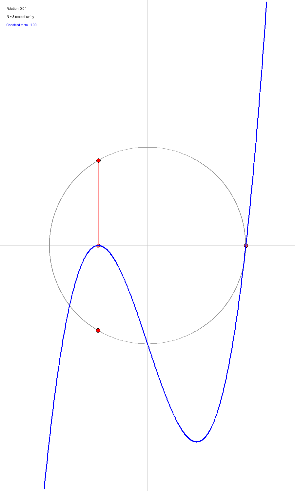
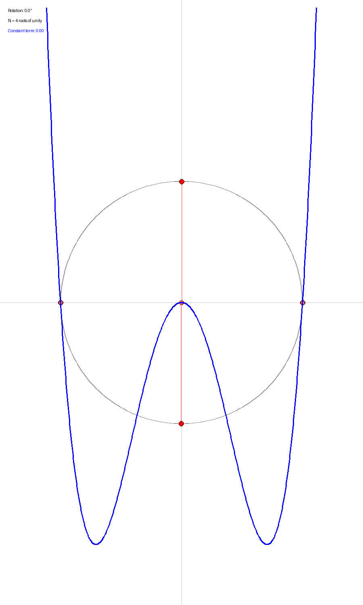

# Chebyshev Circles

[](https://github.com/e-vergo/ChebyshevCircles/actions)
[](https://e-vergo.github.io/ChebyshevCircles/)
[](LICENSE)

When the N-th roots of unity are rotated by angle φ and projected onto the real axis and then taken to be the roots of a polynomial, after scaling by 2^(N-1) the polynomial formed from these projections equals the N-th Chebyshev polynomial of the first kind plus a φ-dependent constant.

```lean
theorem rotated_roots_yield_chebyshev (N : ℕ) (φ : ℝ) (hN : 0 < N) :
    ∃ (c : ℝ), scaledPolynomial N φ = Polynomial.Chebyshev.T ℝ N + C c
```

**Construction:**
- Projected roots: `cos(φ + 2πk/N)` for k = 0, ..., N-1
- Unscaled polynomial: `P(x) = ∏(x - cos(φ + 2πk/N))`
- Scaled polynomial: `S(x) = 2^(N-1) · P(x)`
- Result: `S(x) = T_N(x) + c(φ)`

## Visualization

The geometric intuition behind this theorem is best understood through animation. When roots of unity are rotated and projected onto the real axis, the resulting polynomial maintains a fixed shape (the Chebyshev polynomial) while only its constant term varies with the rotation angle.


*Animation showing N=5 roots of unity being rotated. Red points on the circle project to pink points on the real axis, which serve as roots for the blue polynomial curve. The curve's shape remains a 5th-degree Chebyshev polynomial; only the constant term changes.*

<details>
<summary>More examples (N=3, 4, 6, 12, 13)</summary>

| N=3 | N=4 |
|-----|-----|
|  |  |

| N=6 | N=12 |
|-----|------|
|  |  |


</details>

## Mathematical Background

**Chebyshev Polynomials** of the first kind, denoted T_N(x), are orthogonal polynomials defined by the recurrence:
- T_0(x) = 1
- T_1(x) = x
- T_{n+1}(x) = 2x·T_n(x) - T_{n-1}(x)

They satisfy T_N(cos θ) = cos(Nθ) and have leading coefficient 2^(N-1) for N ≥ 1.

**Why This Connection Matters:** This theorem reveals a surprising geometric interpretation of Chebyshev polynomials. Rather than defining them via recurrence relations or cosine composition, we can construct them by:
1. Taking N equally-spaced points on the unit circle
2. Rotating them by any angle φ
3. Projecting onto the real axis
4. Building the monic polynomial with these projections as roots
5. Scaling by 2^(N-1)

The result is always T_N(x) plus a constant. This provides a bridge between:
- **Discrete geometry** (roots of unity on the circle)
- **Harmonic analysis** (discrete orthogonality relations)
- **Polynomial theory** (Chebyshev polynomials)

## Project Organization

This project is split into two main components: (1) Python scripts used to generate animated gifs visualizing the behavior that results from the proof statement, and (2) A complete verification structured into 10 modules totaling 3,457 lines of Lean 4 code:

| Module | Lines | Purpose |
|--------|-------|---------|
| [RootsOfUnity.lean](ChebyshevCircles/RootsOfUnity.lean) | 108 | Root definitions and list properties |
| [PolynomialConstruction.lean](ChebyshevCircles/PolynomialConstruction.lean) | 541 | Polynomial construction from roots |
| [TrigonometricIdentities.lean](ChebyshevCircles/TrigonometricIdentities.lean) | 137 | Trigonometric sum identities |
| [ChebyshevRoots.lean](ChebyshevCircles/ChebyshevRoots.lean) | 235 | Chebyshev root characterization |
| [PowerSums.lean](ChebyshevCircles/PowerSums.lean) | 705 | Power sum φ-invariance |
| [NewtonIdentities.lean](ChebyshevCircles/NewtonIdentities.lean) | 317 | Newton's identities framework |
| [PolynomialProperties.lean](ChebyshevCircles/PolynomialProperties.lean) | 130 | Polynomial degree and coefficient properties |
| [PowerSumEquality.lean](ChebyshevCircles/PowerSumEquality.lean) | 273 | General power sum equality |
| [ChebyshevOrthogonality.lean](ChebyshevCircles/ChebyshevOrthogonality.lean) | 538 | Discrete orthogonality relations |
| [MainTheorem.lean](ChebyshevCircles/MainTheorem.lean) | 473 | Main theorem and supporting results |

## Proof Strategy

The verification follows a carefully structured approach:

**Step 1: Root Characterization**
Both the rotated roots and Chebyshev roots can be expressed as cosines of equally-spaced angles (modulo phase shifts). This parallel structure is established in `ChebyshevRoots.lean`.

**Step 2: Power Sum Invariance**
The key insight: For any polynomial, power sums of its roots determine all coefficients (via Newton's identities). We prove in `PowerSums.lean` that:
```lean
∑_{k=0}^{N-1} cos(φ + 2πk/N)^m = ∑_{k=0}^{N-1} cos(2πk/N)^m
```
for all m > 0. This shows the rotated roots and unrotated roots have identical power sums (except m=0).

**Step 3: Discrete Orthogonality**
The power sum equality relies on discrete orthogonality of complex exponentials over N-th roots of unity. `ChebyshevOrthogonality.lean` proves:
```lean
∑_{k=0}^{N-1} exp(i·j·2πk/N) = 0  (when j ≠ 0 mod N)
```
This is the discrete analog of continuous Fourier orthogonality.

**Step 4: Newton's Identities**
`NewtonIdentities.lean` implements the bridge between power sums and elementary symmetric polynomials (which determine polynomial coefficients). For polynomials of the same degree with identical power sums (except the 0-th), all coefficients match except the constant term.

**Step 5: Assembly**
`MainTheorem.lean` combines these results: since scaled polynomials from rotated and unrotated roots have identical non-constant coefficients and the same degree, they differ only by a constant. The unrotated case (φ=0) is shown to equal T_N.

**Technical Challenges Overcome:**
- Handling complex/real conversions in power sum computations
- Proving non-degeneracy of roots (no duplicates) for polynomial construction
- Managing index arithmetic modulo N in discrete sums
- Careful degree tracking to apply Newton's identities correctly

## Prerequisites

**Mathematical Background:**
- Undergraduate algebra: polynomials, roots, symmetric functions
- Complex numbers and exponentials
- Trigonometric identities
- Familiarity with orthogonal polynomials (helpful but not required)

**Software Requirements:**
- [Lean 4](https://leanprover.github.io/) (v4.25.0-rc2)
- [Lake](https://github.com/leanprover/lake) (Lean's build tool, included with Lean)
- [Python 3.7+](https://www.python.org/) (for visualizations only)

**Expected Build Time:** ~5-10 minutes on first build (compiles Mathlib dependencies)

## Installation

### Lean 4 Verification

1. **Install Lean 4:**
   ```bash
   # Via elan (recommended)
   curl https://raw.githubusercontent.com/leanprover/elan/master/elan-init.sh -sSf | sh
   ```

2. **Clone and build:**
   ```bash
   git clone https://github.com/e-vergo/ChebyshevCircles.git
   cd ChebyshevCircles
   lake exe cache get  # Download cached Mathlib builds (optional but recommended)
   lake build
   ```

3. **Verify the proof:**
   ```bash
   lake build ChebyshevCircles
   ```
   If successful, all 3,457 lines of proof are verified with no `sorry` statements.

### Python Visualizations

1. **Create virtual environment:**
   ```bash
   python3 -m venv .venv
   source .venv/bin/activate  # On Windows: .venv\Scripts\activate
   ```

2. **Install dependencies:**
   ```bash
   pip install -r requirements.txt
   ```

3. **Generate animations:**
   ```bash
   python main.py
   ```
   This creates 6 GIF files in `chebyshev_gifs/` (one for each N ∈ {3,4,5,6,12,13}).

## Usage

**Explore the proofs:**
```bash
# Open in VS Code with Lean 4 extension
code ChebyshevCircles/MainTheorem.lean

# Check a specific module
lake build ChebyshevCircles.PowerSums

# View generated documentation (after GitHub Pages deployment)
# Navigate to: https://e-vergo.github.io/ChebyshevCircles/
```

**Examine proof states:**
The Lean 4 VS Code extension shows the proof state (goals and hypotheses) at any cursor position. Key theorems to explore:
- `MainTheorem.lean:446` - Main theorem statement
- `PowerSums.lean:287` - Power sum invariance
- `ChebyshevOrthogonality.lean:412` - Discrete orthogonality
- `NewtonIdentities.lean:156` - Newton's identities application

**Customize visualizations:**
Edit `main.py` to change:
- `N_values` (line 156): Which roots of unity to animate
- `num_frames` (line 161): Animation smoothness
- `plot_x_range`, `plot_y_range` (lines 75-76): Axis ranges

## Contributing

This project has completed its primary goal of verifying the main theorem. Potential extensions:
- Generalize to Chebyshev polynomials of the second kind (U_N)
- Prove analogous results for other orthogonal polynomial families
- Optimize proof tactics for better maintainability
- Add interactive web visualizations

Pull requests welcome. Please ensure:
- All proofs compile with `lake build`
- No `sorry` statements introduced
- Code follows Mathlib style conventions

## Citation

If you use this formalization in your research, please cite:

```bibtex
@misc{chebyshev-circles-2025,
  author = {Eric},
  title = {Chebyshev Circles: Formal Verification of Rotated Roots of Unity},
  year = {2025},
  publisher = {GitHub},
  url = {https://github.com/e-vergo/ChebyshevCircles}
}
```

## License

This project is licensed under the Apache License 2.0 - see the [LICENSE](LICENSE) file for details.

Copyright (c) 2025 Eric. All rights reserved.

## Acknowledgments

- Built with [Lean 4](https://leanprover.github.io/) and [Mathlib](https://leanprover-community.github.io/)
- Visualizations created with NumPy and Pillow
- CI infrastructure via [lean-action](https://github.com/leanprover/lean-action)
